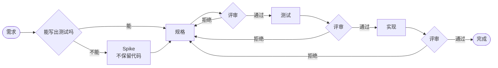

# A10 Review 前置原则

> 本条目合并了原先的四条：`A10-review-前置原则`、`W8-规格优先的-AI-协作流程`、
> `S27-规格优先-review`、`patterns/review-marginal-value`。
> 旧编号保留在 `aliases` 里，便于按旧名检索。

## 上下文

AI 让"实现"的边际成本趋近于零，但**人的 review 带宽没有增加**。
继续按"AI 写完 → 用户 review 代码"协作，review 会成为瓶颈并被形式化 ——
用户扫一眼就放过，问题延后到生产环境。

**这是同一条定律的实例**：任何一环的生产成本趋近于零，价值就迁移到"选择 / 验证"那一环。
代码免费 → review 上移；测试免费 → 规格先行；条目免费 → 修剪与验证。

## 问题

- 用户 review **实现细节** —— 那是信息密度最低、review 成本最高的一层。
- 实现错误与需求错误混在一起，无法定位。
- 用户逐渐失去对系统的理解 —— "这不是我的项目，是 AI 的"。

## 方案

### 一、Review 对象优先级（核心）

| 优先级 | 对象 | 拦截什么 | review 成本 |
| :---: | :--- | :--- | :---: |
| 1 | **规格**（自然语言 / 示例 / 表格 / 伪代码） | 做错方向 | 极低 |
| 2 | **测试**（规格的形式化表达） | 行为不符 | 低 |
| 3 | **类型 / 接口**（结构与契约） | 结构错位 | 中 |
| 4 | 实现细节（算法 / 局部逻辑） | 局部 bug | 高 |

**用户不应直接 review 实现细节 —— 除非前三层已经通过。**

**为什么是"优先级"而不是"清单"**：越靠上，一次 review 能排除的可能性越多；
越靠下，成本上升而拦截效果下降 —— 边际价值随抽象层次下降。

### 二、五阶段流程（+ 可选 Spike）

**图本身就是判据**：`规格` 到 `实现` **没有直连的边**。
所以"跳过评审直接实现"不是"不太好"，而是**图里不存在的转移**。

- **上游产出物必须先评审通过，才进入下游。**
- 下游失败**回退到上游**（三条拒绝边全部回到 `规格`），而不是在下游打补丁。
- **Spike 判定**：能不能在**不写任何实现代码**的前提下写出测试？
  能 → 跳过 Spike；不能 → 先 Spike（代码不保留，只带走结论）—— 见 [[W9-Spike-工作流]]。

### 三、五个对策（针对 AI 协作特有的失效）

| 陷阱 | 症状 | 对策 |
| :--- | :--- | :--- |
| **测试代码也会爆炸** | 20 个测试 = 500 行 | 按行为分组、表驱动、`toMatchInlineSnapshot`；review 名字与边界，而非每个 `expect` |
| **测试和实现"同错"** | AI 误解需求，测试跟着错 | 规格先于测试；测试必须包含**反面案例** |
| **迭代不收敛** | "用户觉得不行 → 反复改" | 每轮定义收敛目标；最小可验证增量；Timebox |
| **小瀑布风险** | 规格 / 测试 / 实现一次性走完 | 循环要**足够小**（一次一个行为）、**可中断** |
| **探索任务不适用** | 需求模糊，写不出测试 | 先区分"清晰任务"与"探索任务" —— 后者先 Spike |

### 四、Review 的本质

**用户 review 的是"意图"，不是"代码"。**

- 测试是意图的**一种**形式化表达，不是唯一形式。
- 规格可以用自然语言、示例、表格、伪代码表达。
- 对非技术评审者，"示例输入输出"比"测试断言"更容易 review。

### 五、规格怎么写（唯一能拦"做错方向"的一层）

- **用"输入分类法"穷举边界**：空 / 单行 / 多行 / 特殊字符 / 代码块 / 并发。
- **列出所有待决策的设计点**，每点给"选项 + 推荐 + 理由"。
- **凡涉及 interface 变更，必须列出所有构造函数 / 实现点**。
- 规格**必须有决策** —— 出现"可能这样也可能那样"，说明还没想透。

### 六、各层怎么 review

| 层 | 怎么看 | 不看 |
| :--- | :--- | :--- |
| 规格 | 意图对不对、边界穷尽没有 | 实现可行性细节 |
| 测试 | 只看 `it` 标题（= 行为清单） | 每个 `expect` 的内部 |
| 类型 / 接口 | 结构与契约是否表达了对的设计 | 方法体 |
| 实现 | 前 3 层通过后，只看关键局部 | 逐行通读 |

### 七、谁 review 什么（角色 × 层次）

| 角色 | 优先 review | 可以跳过 |
| :--- | :--- | :--- |
| 产品 / 需求方 | 规格 + 示例 | 测试 / 类型 / 实现 |
| 技术负责人 | 规格 + 测试 + 类型 | 实现细节 |
| 代码审查者 | 类型 + 关键实现 | 测试（已过 CI） |
| 运维 | 接口 + 配置 | 其他 |

## 反面

- 不要把**所有**任务塞进这个流程 —— 探索任务先探索，收敛后再进来。
- 不要把"用户点了个头"当成 review 通过 —— **review 必须看过产出物本身**。
- 不要用"AI 说它对"替代"我理解它对"。
- 不要让流程僵化 —— 它是骨架，不是监狱；并行、异步、模糊都有空间。
- 不要在规格里写"可能这样也可能那样" —— 不确定 = 未想透。
- **不要用编造的数字壮声势**：本条目曾写"边际价值增加 3-5 倍""等价于读 1000 行代码" ——
  无来源、不可验证，正是 [[patterns/design-decision]] 禁止的"拿最佳实践当理由"。已删除。

## 关联

[[patterns/design-decision]] [[patterns/cross-domain-borrowing]] [[A12-知识笔记返回]] [[W9-Spike-工作流]] [[W2-three-stage-analysis]] [[patterns/hierarchical-actor-collaboration]] [[patterns/design-decision]]
